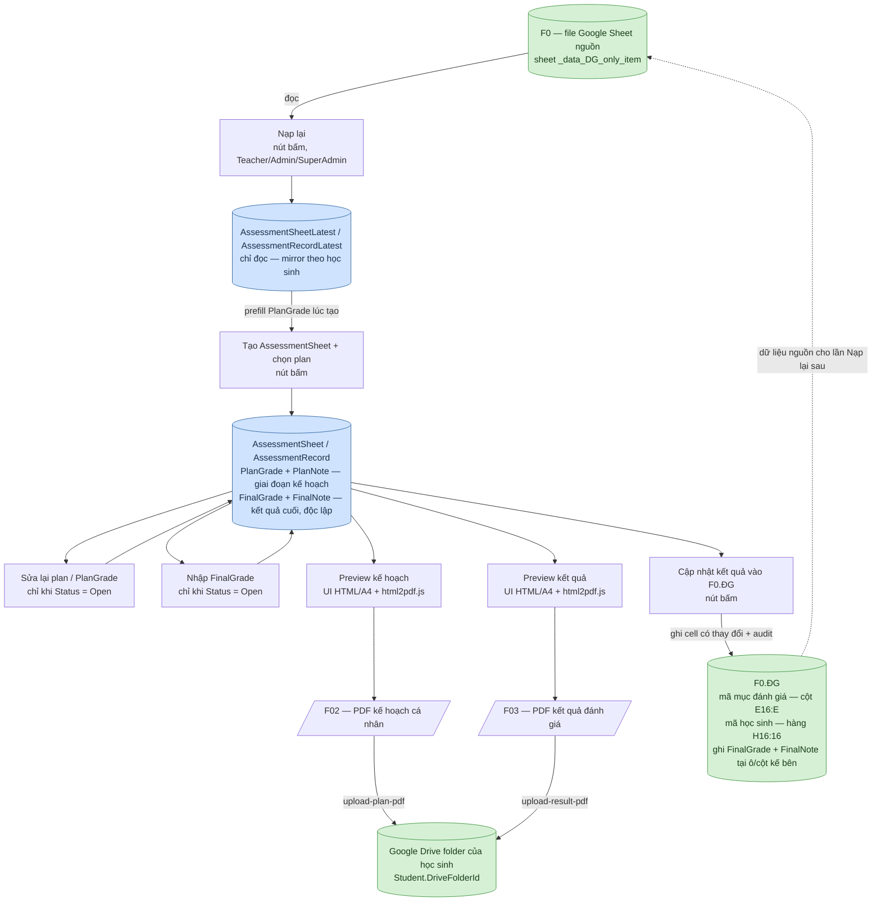

# 09 — Sơ đồ luồng dữ liệu Bảng đánh giá năng lực

Sơ đồ minh hoạ luồng dữ liệu mô tả bằng chữ trong [09-bang-danh-gia-nang-luc.md](09-bang-danh-gia-nang-luc.md). Xem file đó để biết chi tiết nghiệp vụ; file này chỉ vẽ lại luồng cho dễ hình dung. Sơ đồ được nhúng sẵn dưới dạng ảnh SVG ([09-bang-danh-gia-nang-luc-so-do-du-lieu.svg](09-bang-danh-gia-nang-luc-so-do-du-lieu.svg)) nên xem được ở bất kỳ trình xem Markdown nào, kể cả khi không hỗ trợ Mermaid; mã Mermaid gốc được gấp lại bên dưới để sửa và tự sinh lại ảnh khi cần.

## Chú thích hình khối

- Hình trụ = Google Sheet / bảng dữ liệu (nguồn hoặc đích).
  - Màu **xanh dương** = bảng dữ liệu trong database (`AssessmentSheet`/`AssessmentRecord`, `...Latest`).
  - Màu **xanh lá** = file/sheet trên Google Sheet/Drive (`F0`, `F0.ĐG`, thư mục Drive học sinh).
- Hình chữ nhật = thao tác **nút bấm thủ công** (không có bước nào tự động chạy ngầm).
- Hình bình hành = file PDF xuất ra.

## Sơ đồ

Mã Mermaid (để sửa và tự sinh lại ảnh khi cần)

## Điểm cần lưu ý khi đọc sơ đồ

1. **Luồng Google Sheet riêng `[F01]` đã ngừng dùng.** Không còn copy file mẫu, không lưu/expose `AssessmentSheetSpreadsheetId`, không ghi `data`/`khcn_template`/`KQ_template` cho từng `AssessmentSheet`.
2. **`Nạp lại`** và **`AssessmentSheetLatest`/`AssessmentRecordLatest`** chỉ phục vụ prefill lúc tạo mới; không có mũi tên ngược từ `AssessmentSheet`/`AssessmentRecord` trở lại 2 bảng này.
3. **PDF `[F02]`/`[F03]`** được render từ UI preview HTML/A4 bằng `html2pdf.js`. Nếu cần lưu Drive, UI upload PDF qua endpoint backend tương ứng; backend chỉ upload file vào `Student.DriveFolderId`.
4. **`F0.ĐG`** chỉ được ghi khi bấm nút cập nhật kết quả — tách biệt hoàn toàn khỏi luồng Nạp lại. Vị trí ghi: dò cột `E16:E` để tìm đúng dòng theo mã mục đánh giá, dò hàng `H16:16` để tìm đúng cột theo mã học sinh, ghi nhãn `FinalGrade` vào ô kết quả và `FinalNote` vào cột kế bên.
5. **`AssessmentRecord` có hai cặp field độc lập:** `PlanGrade`/`PlanNote` (giai đoạn kế hoạch, dùng cho `[F02]`) và `FinalGrade`/`FinalNote` (kết quả cuối, dùng cho `[F03]`/`F0.ĐG`) — sửa cặp này không ảnh hưởng cặp kia.
