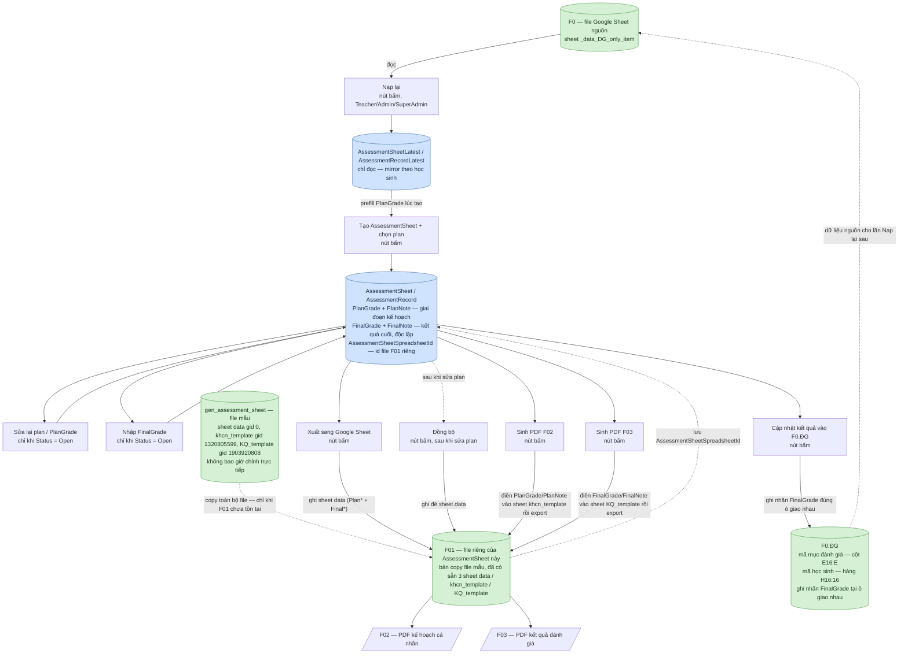

# 09 — Sơ đồ luồng dữ liệu Bảng đánh giá năng lực

Sơ đồ minh hoạ luồng dữ liệu mô tả bằng chữ trong [09-bang-danh-gia-nang-luc.md](09-bang-danh-gia-nang-luc.md). Xem file đó để biết chi tiết nghiệp vụ; file này chỉ vẽ lại luồng cho dễ hình dung. Sơ đồ được nhúng sẵn dưới dạng ảnh SVG ([09-bang-danh-gia-nang-luc-so-do-du-lieu.svg](09-bang-danh-gia-nang-luc-so-do-du-lieu.svg)) nên xem được ở bất kỳ trình xem Markdown nào, kể cả khi không hỗ trợ Mermaid; mã Mermaid gốc được gấp lại bên dưới để sửa và tự sinh lại ảnh khi cần.

## Chú thích hình khối

- Hình trụ = Google Sheet / bảng dữ liệu (nguồn hoặc đích).
  - Màu **xanh dương** = bảng dữ liệu trong database (`AssessmentSheet`/`AssessmentRecord`, `...Latest`).
  - Màu **xanh lá** = file/sheet trên Google Sheet (`F0`, file mẫu `gen_assessment_sheet`, `F01`, `F0.ĐG`).
- Hình chữ nhật = thao tác **nút bấm thủ công** (không có bước nào tự động chạy ngầm).
- Hình bình hành = file PDF xuất ra.

## Sơ đồ

Mã Mermaid (để sửa và tự sinh lại ảnh khi cần)

## Điểm cần lưu ý khi đọc sơ đồ

1. **`gen_assessment_sheet` là file mẫu cố định, không bao giờ bị chỉnh sửa trực tiếp.** Mỗi `AssessmentSheet` có file Google Sheet riêng (`F01`), tạo ra bằng cách **copy toàn bộ file mẫu** (Drive file copy) — không phải tạo/copy từng sheet lẻ trong một file dùng chung. `F01` đã có sẵn cả 3 sheet `data`/`khcn_template`/`KQ_template` ngay từ lúc copy vì đó là bản sao nguyên file.
2. Việc copy chỉ xảy ra **một lần** cho mỗi `AssessmentSheet` — id file kết quả được lưu vào `AssessmentSheet.AssessmentSheetSpreadsheetId`. Mọi hành động sau đó (Xuất, Đồng bộ, Sinh PDF F02/F03) đều thao tác trên chính file `F01` đó, không đụng lại vào `gen_assessment_sheet`.
3. **`Nạp lại`** và **`AssessmentSheetLatest`/`AssessmentRecordLatest`** chỉ phục vụ prefill lúc tạo mới; không có mũi tên ngược từ `AssessmentSheet`/`AssessmentRecord` trở lại 2 bảng này.
4. **Sheet `data`** trong `F01` được ghi trực tiếp từ `AssessmentRecord` hiện tại — lần đầu ở bước Xuất sang Google Sheet, cập nhật lại ở bước Đồng bộ.
5. **Sheet `khcn_template`/`KQ_template`** trong `F01` được điền dữ liệu mới nhất và export thành PDF **ngay tại mỗi lần bấm "Sinh PDF"** tương ứng — không cần thêm bước copy sheet nào nữa vì cả 2 sheet này đã có sẵn trong `F01` từ lúc copy file.
6. **`F0.ĐG`** chỉ được ghi khi bấm nút cập nhật kết quả — tách biệt hoàn toàn khỏi luồng Nạp lại. Vị trí ghi: dò cột `E16:E` để tìm đúng dòng theo mã mục đánh giá, dò hàng `H16:16` để tìm đúng cột theo mã học sinh, ghi nhãn `FinalGrade` (không phải chữ cái `A/B/C/D`) vào đúng ô giao nhau.
7. **`AssessmentRecord` có hai cặp field độc lập:** `PlanGrade`/`PlanNote` (giai đoạn kế hoạch, dùng cho `khcn_template`/`[F02]`) và `FinalGrade`/`FinalNote` (kết quả cuối, dùng cho `KQ_template`/`[F03]`/`F0.ĐG`) — sửa cặp này không ảnh hưởng cặp kia.
